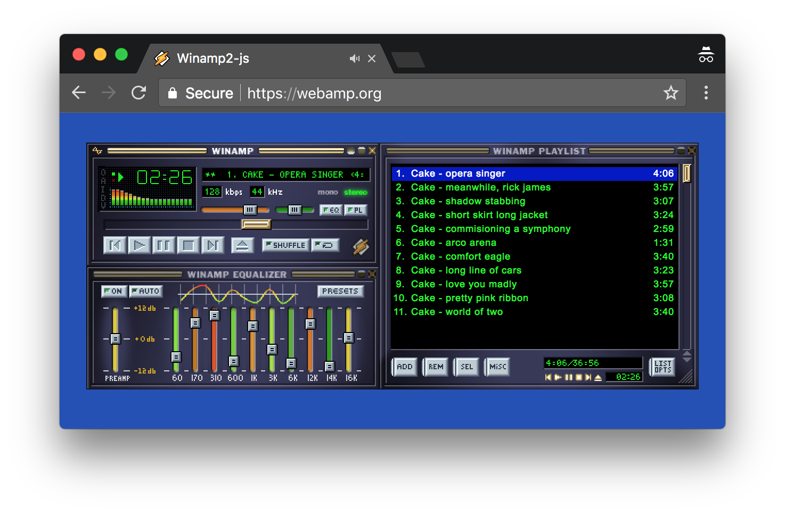

  

# Webamp

A reimplementation of Winamp 2.9 in HTML5 and JavaScript.

**As seen on [TechCrunch], [Motherboard], [Gizmodo], Hacker News ([1], [2], [3], [4]), and [elsewhere](./docs/press.md).**

## [Give it a try!](https://webamp.org)

Works in modern versions of Edge, Firefox, Safari and Chrome. IE is [not
supported](http://caniuse.com/#feat=audio-api).

## Features

Check out this Twitter thread for an illustrated list of features: https://twitter.com/captbaritone/status/961274714013319168

## Use Webamp in your own project

I've tried to make it possible to include Webamp in your own project.

See the [usage documentation](./docs/usage.md) for more information.

## Development

    yarn
    # Or: npm install
    npm start

Open `http://localhost:8080/webpack-dev-server/` in your browser.

    # Run tests and lint checks
    npm test

## Building

    npm run build
    npm run serve

Open the local ip/port that is output to the console in your browser.

## Testing

    npm test

This will run both the tests and the linter.

## Deploying

[Netlify](https://www.netlify.com/) watches GitHub for new versions of master. When a new version is seen, it is automatically built using `npm run build` and pushed to the server. Additionally, Netlify will run a build on every pull request and include a link under the heading "Deploy preview ready!". This enables easy high level testing of pull requests.

In short, deploying should be as simple as pushing a commit to master.

Additionally, if you want to fork the project, deploying should be as simple as setting up a free Netlify account.

### Advanced Usage

There are some "feature flags" which you can manipulate by passing a specially crafted URL hash. Simply supply a JSON blob after the `#` of the URL to change these settings:

- `skinUrl` (string) Url of the default skin to use. Note, this file must be served with the correct Allows Origin header.
- `audioUrl` (string) Url of the default audio file to use. Note, this file must be served with the correct Allows Origin header.
- `initialState` (object) Override the [initial Redux state](js/reducers.js). Values from this object will be recursively merged into the actual default state.

**Note:** These are intended mostly as development tools and are subject to change at any time.

## Community

Join our community chat on Discord: <https://discord.gg/fBTDMqR>

There are a few related projects that have communites:

- [Winamp Community Update Pack] - "New plug-ins to add additional features to Winamp as well as replacement plug-ins to provide better implementations of some of the plug-ins natively included with Winamp". ([Forum](https://getwacup.com/community/) / [Discord server](https://discord.gg/5pVTdbj))
- [Webvs](https://gitter.im/visbot/AVS) -
  A Winamp AVS like visualization library for the web. ([Gitter chat](https://gitter.im/visbot/AVS))

## Reference

- [skinspecs.pdf](http://members.xoom.it/skinart/tutorial/skinspecs..pdf)
- [Skinner's Atlas 1.5 by Jellby](http://forums.winamp.com/showthread.php?p=951257)
- [Winamp Skinning Tutorial](http://people.xmms2.org/~tru/promoe/Winamp_skinning_tutorial_1_5_0.pdf)
- Sacrat Skinning tutorial parts [1](http://www.hugi.scene.org/online/hugi26/hugi%2026%20-%20graphics%20skinning%20sacrat%20winamp%20skinning%20tutorial%20-%201.htm), [2](http://www.hugi.scene.org/online/hugi26/hugi%2026%20-%20graphics%20skinning%20sacrat%20winamp%20skinning%20tutorial%20-%202.htm), [3](http://www.hugi.scene.org/online/hugi26/hugi%2026%20-%20graphics%20skinning%20sacrat%20winamp%20skinning%20tutorial%20-%203.htm), [4](http://www.hugi.scene.org/online/hugi26/hugi%2026%20-%20graphics%20skinning%20sacrat%20winamp%20skinning%20tutorial%20-%204.htm), and [5](http://www.hugi.scene.org/online/hugi26/hugi%2026%20-%20graphics%20skinning%20sacrat%20winamp%20skinning%20tutorial%20-%205.htm),
- [Winamp Wiki](http://wiki.winamp.com/wiki/Creating_Classic_Skins)

## Predecessors

- [Webamp2x](http://forums.winamp.com/showthread.php?threadid=91850) An
  impressive implementation from 2002(!).
- [JsAmp](http://freecog.net/2005/jsamp/demo/MainWindow.xhtml) An implementation from 2005 by @twm (via [Hacker News](https://news.ycombinator.com/item?id=15317723)).
- [LlamaCloud Comp](https://vimeo.com/20149683) From 2011 by [Lee Martin](http://www.leemartin.com/) (via [Twitter](https://twitter.com/leemartin/status/910235793737814017))
- [Winamp em HTML5 e Javascript](http://www.tidbits.com.br/winamp-em-html5-e-javascript)
  In 2010 a developer named Danilo posted one of his HTML5 experiments: "an
  audio player simulating good old Winamp". You will have to download the zip
  file.
- [JuicyDrop](http://cggaurav.github.io/juicydrop/) An HTML5 implementation with
  less emphasis on being true to the skin, but fully featured visualizations.
  @cggaurav is keeping it alive on [GitHub](https://github.com/cggaurav/juicydrop)
- [Spotiamp](http://spotiamp.com/) The folks at Spotify reimplemented Winamp as
  a frontend for Spotify. Not in a browser, and only runs on Windows.

## Thanks

- [Butterchurn](https://github.com/jberg/butterchurn), the amazing Mikdrop 2 WebGL implementation. Built and integrated into Webamp by: [jberg](https://github.com/jberg)
- Research and feature prototyping: @PAEz
- Beta feedback, catching many small UI inconsistencies: [LuigiHann](https://twitter.com/LuigiHann)
- Beta feedback and insider answers to obscure Winamp questions: [Darren Owen](https://twitter.com/The_DoctorO)
- Donating the `webamp` NPM module name: [Dave Eddy](http://daveeddy.com/)

Thank you to [Justin Frankel](http://www.1014.org/) and everyone at Nullsoft
for Winamp which inspired so many of us.

## License

While the Winamp name, interface, and, sample audio file are surely property of
Nullsoft, the code within this project is released under the [MIT
License](LICENSE.txt). That being said, if you do anything interesting with
this code, please let me know. I'd love to see it.

[techcrunch]: https://techcrunch.com/2018/02/09/whip-the-llamas-ass-with-this-javascript-winamp-emulator/
[motherboard]: https://motherboard.vice.com/en_us/article/qvebbv/winamp-2-mp3-music-player-emulator
[gizmodo]: https://gizmodo.com/winamp-2-has-been-immortalized-in-html5-for-your-pleasu-1655373653
[1]: https://news.ycombinator.com/item?id=8565665
[2]: https://news.ycombinator.com/item?id=15314629
[3]: https://news.ycombinator.com/item?id=16333550
[4]: https://news.ycombinator.com/item?id=17583997
[winamp community update pack]: https://getwacup.com/
